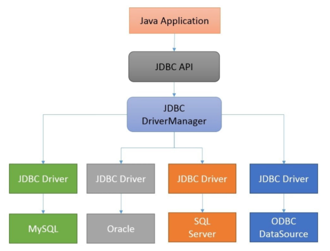
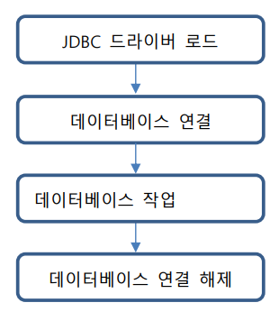
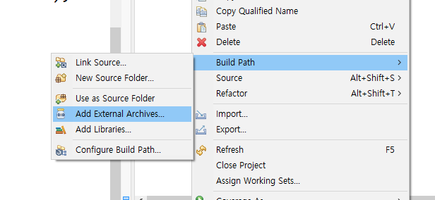
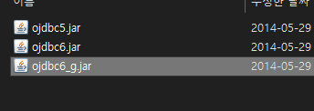
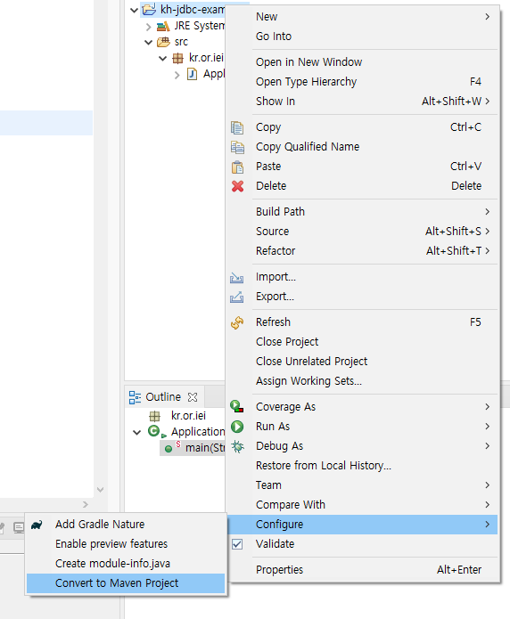
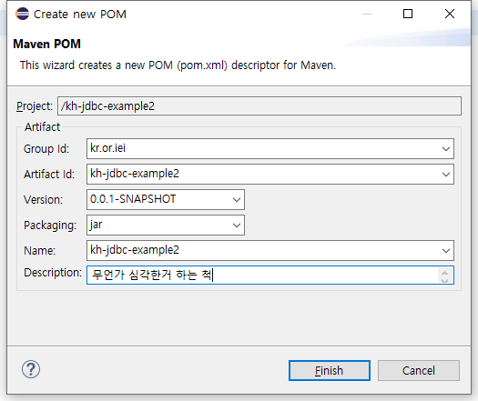

# 1. JDBC(Java Database Connectivity)

JDBC는 자바 애플리케이션에서 DB에 접근할 수 있도록 하는 API이다.  



DMBS와 통신하여 DB의 기능을 사용하는 구현체는 각각 벤더의 jdbc Driver들이 가지고 있다. JDBC API는 `java.sql` 패키지에 위치하고 있다.  

# 2. JDBC 동작 단계



# 3. 실습 환경 구축

다음 두 가지 방법으로 진행하도록 하겠음

- 수동 설치
- 메이븐 설치

## 3.1. 수동

`Build Path` > `Add External Archives...` 선택



`ojdbc6_g.jar` 선택



Referenced Libraries에 등록되면 성공


## 3.2. 메이븐

`Configure` > `Convert to Maven Project` 선택



아티팩트 정보를 적어준다.  



의존성을 추가해준다.  

## 3.3. 테스트 를! 할거에요

```java
package kr.or.iei;

import java.sql.Connection;
import java.sql.DriverManager;
import java.sql.PreparedStatement;
import java.sql.ResultSet;
import java.sql.SQLException;

public class Application {

	public static void main(String[] args) throws ClassNotFoundException {
		System.out.println("ㅇㅅㅇ");
		Class.forName("oracle.jdbc.driver.OracleDriver");
		try (final Connection conn = 
				DriverManager.getConnection("jdbc:oracle:thin:@localhost:1521:XE", "system", "oracle")) {			
			final PreparedStatement pstmt = conn.prepareStatement("SELECT length('abcdbc') FROM dual");
			final ResultSet rs = pstmt.executeQuery();
			rs.next();
			System.out.println(rs.getInt(1));
			rs.close();
			pstmt.close();
			conn.close();
		} catch (SQLException e) {
			// TODO Auto-generated catch block
			e.printStackTrace();
		}
	}
}
```

# 4. JDBC 코드 구현

코드 흐름은 크게 다음과 같다.  

1. JDBC Driver 로드
2. 데이터베이스 연결
3. 데이터베이스 작업
4. 연결 종료

## 4.1. JDBC Driver 로드

```java
Class.forName("oracle.jdbc.driver.OracleDriver");
```

이렇게 하면 JVM에 클래스를 로드해줄 수 있다.  

## 4.2. 데이터베이스에 연결

JDBC url 형식을 보자.  

```text
jdbc:oracle:thin:[호스트이름]:[포트]:[db이름]
```

앞선 코드에선 다음과 같이 작성하였다.  

```java
jdbc:oracle:thin:@localhost:1521:XE
```

커넥션 객체를 얻기 위한 코드는 다음과 같다.  

```java
final Connection conn = DriverManager.getConnection(
    "jdbc:oracle:thin:@localhost:1521:XE",
    "id",
    "password"
);
```

